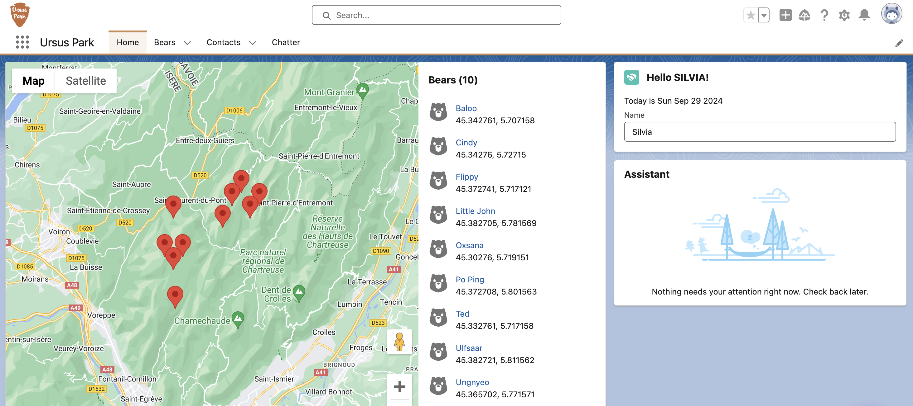
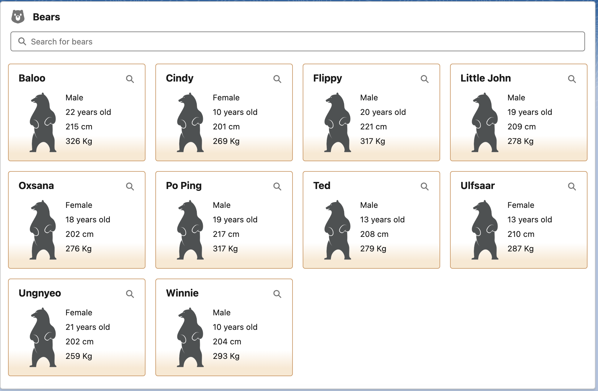

# Ursus Park Bear-Tracking App

The Ursus Park Bear-Tracking App enables park rangers to track bears and view details about each bear through a user-friendly interface that includes a map and individual bear cards with key details.

## Overview

The Ursus Park Bear-Tracking App provides an interactive way for rangers to:

- View a list of bears and their details (e.g., name, age, height, weight).
- Filter bears using a search bar.
- Track bear locations on a map with clickable markers for each bear.
- Navigate to a detailed bear record directly from the bear list or map.

## Features
- **Bear List**: Displays a list of bears with their basic details such as name, sex, age, height, and weight.
- **Search Functionality**: Park rangers can search for bears by name using a search input.
- **Bear Tiles**: Each bear is represented by a customizable tile with detailed information.
- **Bear Detail Navigation**: Clicking on a bear tile allows rangers to view detailed bear records.
- **Bear Map**: Displays the location of bears on a map as per the search filter.
- **Responsive Layout**: The UI is responsive, with an organized layout for all screen sizes.

## Tech Stack
- **Salesforce**: Using Salesforce platform for Apex controllers and schema objects (e.g., `Bear__c`).
- **Lightning Web Components (LWC)**: For building modular components.
- **Lightning Message Service (LMS)**: Used to communicate between components such as `bearList` and `bearMap`.
- **Apex**: Backend logic for querying bear data using `BearController` class.
- **SLDS**: Styled using Salesforce Lightning Design System (SLDS).

## Screenshots

### Home Page with Bear Locations
Here is the home page where you can see the map with the bears' locations displayed as markers.

### Bear Cards with Details
Below is a screenshot showing the bear cards, where each bear’s name, sex, age, height, and weight are displayed.

## Project Summary

This project was built as part of the Salesforce Trailhead module [Build Flexible Apps with Lightning Web Components](https://trailhead.salesforce.com/content/learn/projects/lwc-build-flexible-apps) and demonstrates how to leverage Salesforce Lightning Web Components (LWC) to build a dynamic and responsive application for Ursus Park. 

The key concepts demonstrated in this project include:

- **Component Communication**: The bear list component sends updates to the map component using the Lightning Message Service (LMS) to keep the map synchronized with the current bear list.
- **Apex Integration**: Apex methods are used to query bear records and pass them to the front-end components. We utilized both wired and imperative methods in LWC to handle data.
- **Dynamic Searching**: Users can filter the bear list in real time using a search bar, which minimizes the number of Apex calls by debouncing the input.
- **Lightning Navigation**: The app allows users to navigate directly from the bear list or map markers to individual bear record pages using Salesforce’s built-in navigation functionalities.

